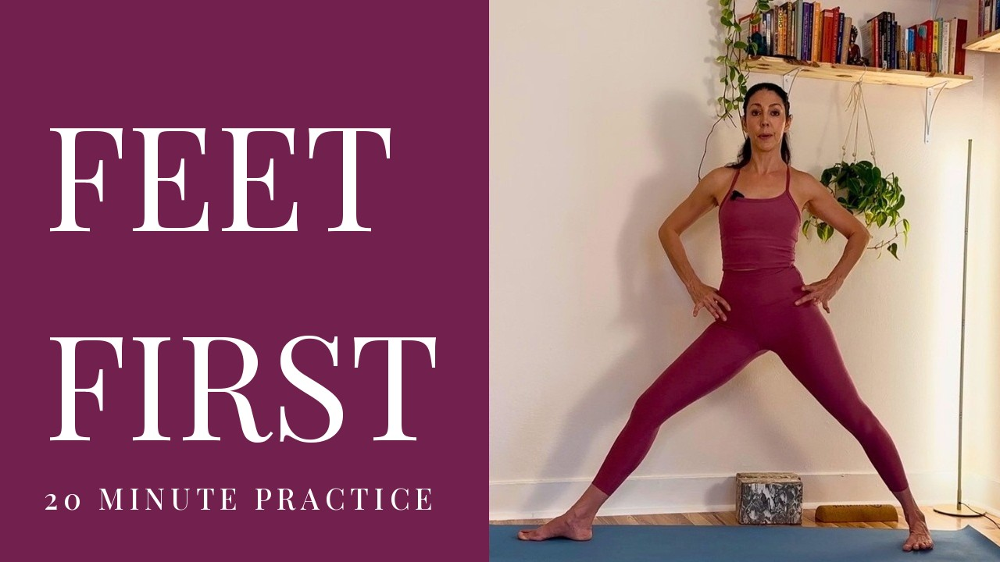

# Thumbnail Maker

A small cross-platform (Windows / macOS / Linux) desktop app that batch-generates
1280×720 YouTube thumbnails in a clean editorial-panel style: a solid color panel
holding a large all-caps serif title and a letter-spaced subtitle, with your photo
filling the rest of the frame.



## What it does

Two tools in one window, as tabs — each keeps its **own** independent settings:

- **Single** — make one thumbnail from one photo with a **title you type**.
  Choose a photo, type a title/subtitle, and Create.
- **Batch** — turn a whole **folder** of photos into thumbnails at once. Titles
  come from each file name (`feet-first.jpg` → **FEET FIRST**) or from a **CSV**.

Both share these ideas:

- **Editable design** — the look is defined by an **SVG template**, not hardcoded.
  Pick a template, or duplicate and edit one to restyle everything. Templates you
  browse to are shared by both tabs. The template dropdown groups entries under
  **Built-in** (the templates shipped in `templates/`) and **Custom** (ones you
  browse to), so it's always clear which is which. Both tabs use the same picker.
- **Auto-fit titles** that shrink and wrap to fit the panel.
- **Live preview** before you render.
- **Remembers your settings per tab** between launches.

Output files are written as `<name>_thumb.jpg` in the chosen output folder.

## Install & run

Requires Python 3.10+ (tkinter ships with the official python.org installers on
Windows and macOS).

```bash
pip install -r requirements.txt
python app.py
```

## Naming your photos

The title is derived from the file name — hyphens, underscores and dots become
spaces. So name the input photos after the video title:

| File name                     | Title on thumbnail   |
| ----------------------------- | -------------------- |
| `feet-first.jpg`              | FEET FIRST           |
| `rebuild_your_foundation.png` | REBUILD YOUR FOUNDATION |
| `hip openers.jpg`             | HIP OPENERS          |

The subtitle (e.g. `20 MINUTE PRACTICE`) is the same for every thumbnail in a
run — unless you override it per photo with a CSV.

## Per-photo titles from a CSV (optional)

To set titles (and other fields) explicitly instead of from file names, pick a
**Titles CSV** in the app. It needs a `filename` column plus any of `title`,
`subtitle`, or custom fields matching `{{tokens}}` in your template:

```csv
filename,title,subtitle
feet-first.jpg,Ankle Mobility,15 minute practice
rebuild-your-foundation.jpg,Balance Basics,25 minute practice
```

Any photo not listed in the CSV falls back to its file-name title and the app's
subtitle. Clear the CSV in the app to go back to file-name titles.

## Settings are remembered

Your input/output folders, selected template (including custom ones you browse
to), subtitle, uppercase choice, and CSV path are saved between launches to a
per-user config file:

- Windows: `%APPDATA%\ThumbnailMaker\settings.json`
- macOS: `~/Library/Application Support/ThumbnailMaker/settings.json`
- Linux: `~/.config/ThumbnailMaker/settings.json`

## Templates (the design is editable)

The visual design lives in an **SVG template** under [`templates/`](templates/),
rendered with [resvg](https://github.com/RazrFalcon/resvg) (a self-contained
renderer bundled into the app — no system libraries required). Five built-in
templates ship with the app, each a distinct layout:

| Template | Look |
| --- | --- |
| `editorial` | Left color panel with a large serif title; photo fills the right. |
| `right-panel` | The editorial layout mirrored — photo left, color panel right. |
| `bottom-bar` | Full-bleed photo with a solid caption bar across the bottom. |
| `lower-third` | Full-bleed photo with a lower-third gradient veil under the title. |
| `top-banner` | Color banner across the top holding the title; photo fills below. |

In the app they appear under the **Built-in** group in the template dropdown;
anything you browse to shows under **Custom**. To create a new look, copy
[`templates/editorial.svg`](templates/editorial.svg), edit it in any
SVG tool (Inkscape, Illustrator, Figma) or a text editor, drop it in `templates/`,
and pick it in the app. Each template follows a small contract:

| What | How |
| --- | --- |
| **Title / subtitle text** | Put the tokens `{{title}}` and `{{subtitle}}` in `<text>` elements. |
| **Photo region** | Give one element `id="photo"` (a `<rect>` is easiest). Each photo is cover-cropped into that box. |
| **Auto-fit a title** | On its `<text>`, add `data-fit="true"` with `data-max-width` (px), `data-max-lines`, and optional `data-line-height`. Its `font-size` is treated as the maximum. |

Everything else (colors, shapes, gradients, logos, extra text) renders exactly as
drawn, so the panel color, fonts, and layout are all yours to change — no code.

> Extra `{{fields}}` beyond title/subtitle can be filled from a CSV; see
> `core.load_titles_csv` and `core.batch_render(..., csv_overrides=...)`.

## Architecture (core vs frontend)

The code is split into a **UI-free core library** and thin **frontends**:

- **`core/`** — the backend. Rendering (`render`, `svgtemplate`), boundary types
  (`Style`, the progress callback), the template library (built-in/custom
  classification), image discovery / title derivation, and settings persistence
  (`core.config`). It imports **no** tkinter and returns PIL `Image` objects or
  writes files — never GUI objects, so it runs headlessly and is unit-tested in
  CI (`.github/workflows/tests.yml`).
- **`app.py`** — the tkinter GUI, and **`cli.py`** — the command line. Each is a
  frontend that depends **only** on `core`'s public API (see `core.__all__`).

The full boundary and public API are documented in
[`docs/architecture.md`](docs/architecture.md).

## Scripting (no GUI)

`core` is a standalone engine you can call directly:

```python
import core
style = core.Style(subtitle="20 MINUTE PRACTICE")   # uses templates/editorial.svg
core.batch_render("photos/", "thumbnails/", style)
```

Or drive it straight from the terminal with the bundled CLI:

```bash
python cli.py single photo.jpg --template editorial --title "FEET FIRST"
python cli.py batch photos/ thumbnails/ --csv titles.csv
python cli.py templates          # list the built-in template names
```

### Writing an alternate frontend

To add your own frontend (web, another GUI, a script), `import core`, build a
`core.Style`, and call `render_thumbnail` / `render_layout` / `batch_render`.
That is the entire dependency — a frontend never imports `core.svgtemplate`
directly or reaches into internals; everything it needs is in `core.__all__`
plus `core.config`. `cli.py` is a complete ~140-line worked example.

## Packaging as a desktop app

The app can be bundled into a standalone double-clickable application with
[PyInstaller](https://pyinstaller.org). **PyInstaller does not cross-compile** —
build the Windows `.exe` on a Windows machine and the macOS `.app` on a Mac. The
same [`ThumbnailMaker.spec`](ThumbnailMaker.spec) is used on both; it bundles the
font and embeds the version number.

The resulting `.exe` / `.app` is **fully self-contained**: it bundles the Python
interpreter, Pillow, tkinter and the font. End users do **not** install Python or
run `pip` — they just double-click. (Each build is OS- and CPU-architecture
specific; see "Automated builds" below.)

**Windows** (produces `dist\ThumbnailMaker.exe`):

```powershell
./build_windows.ps1
```

**macOS** (produces `dist/Thumbnail Maker.app`):

```bash
./build_macos.sh
```

The version comes from [`version.py`](version.py) (single source of truth). It is
shown in the window title and footer of the GUI, and embedded in the build — the
Windows `.exe` file-properties version resource and the macOS `Info.plist`
(`CFBundleShortVersionString`). Bump `__version__` there and rebuild.

### Automated builds (GitHub Actions)

[`.github/workflows/build.yml`](.github/workflows/build.yml) builds both apps in
the cloud so you don't need both machines. Push a version tag and it builds the
Windows `.exe` and macOS `.app`, then attaches them to a GitHub Release:

```bash
# bump __version__ in version.py first, then:
git tag v1.0.0
git push origin v1.0.0
```

You can also run it on demand from the repo's **Actions** tab (workflow_dispatch),
which uploads the apps as downloadable artifacts without creating a release.

> Note on macOS architecture: GitHub's `macos-latest` runners are Apple Silicon,
> so the produced `.app` is arm64 (Apple Silicon) native. To also support Intel
> Macs, add an `macos-13` (x86_64) entry to the workflow matrix.

### Distribution notes

- **macOS Gatekeeper:** an unsigned `.app` shows "unidentified developer" on first
  launch. Users right-click → **Open** once, or you run
  `xattr -dr com.apple.quarantine "dist/Thumbnail Maker.app"`. For frictionless
  distribution you'd need an Apple Developer ID to sign + notarize.
- **Windows SmartScreen** may warn on an unsigned `.exe`; a code-signing
  certificate removes it.
- **Icons** are optional — drop `assets/icon.ico` (Windows) / `assets/icon.icns`
  (macOS) and set the `icon=` fields in the spec.

## Font & license

Titles use **Playfair Display** (SIL Open Font License), bundled in `fonts/`
(`fonts/OFL.txt`) so output looks identical on every OS. Application code is
yours to use freely.
